User
================================

Player Page
--------

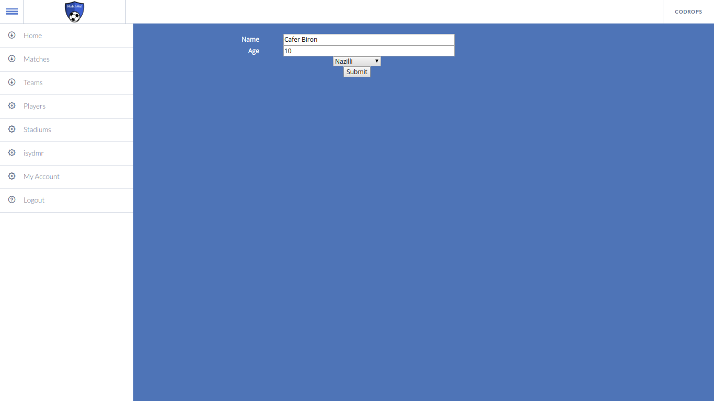

It is how player page looks like at first. This page is used for creating player profiles for each user.
Name, age, team information entered in this page.

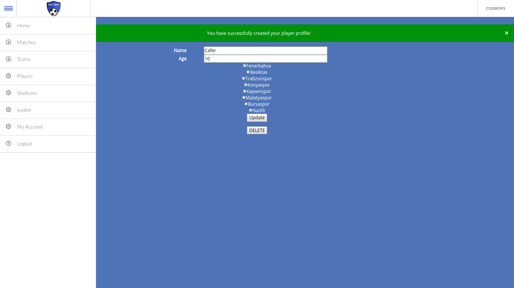

It is how player page looks like after creating a player profile.
Here, a player can change its name, age, and team information and also player can be deleted.

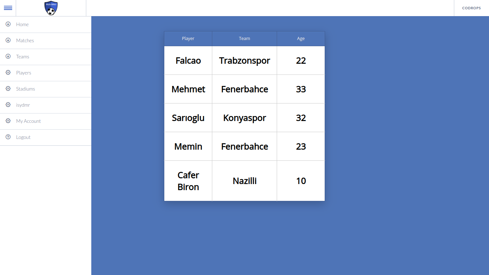

After player profile created, all players seen in players page with their team and age info.

Team Page
--------

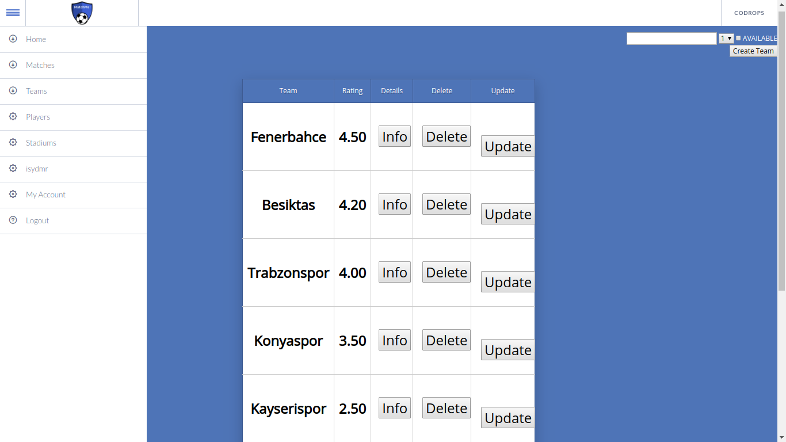

This is teams page, all teams shown in one table.

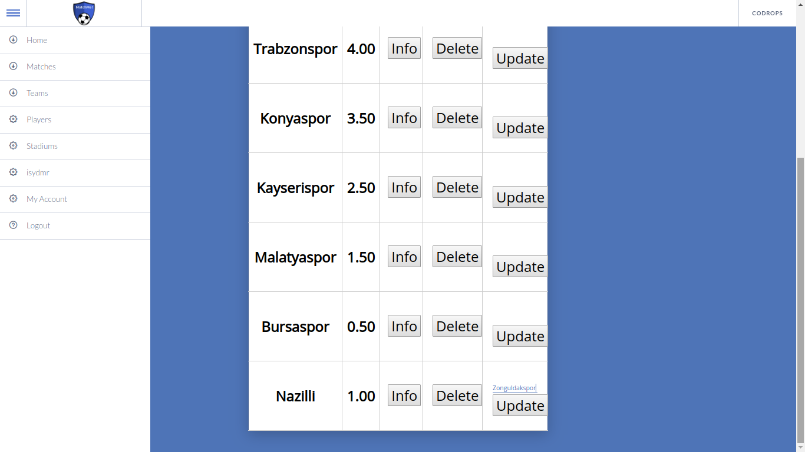

In this table, team name can be changed using the update button. New team name written on top of Update button.
A team can be deleted using Delete button.

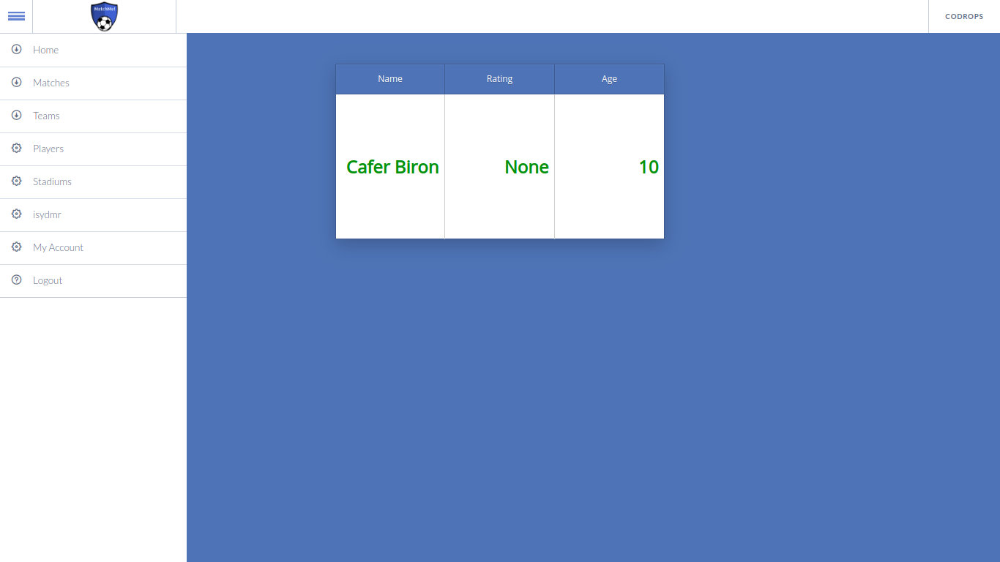

This page is team information page. Info button can be used to see players of a team.

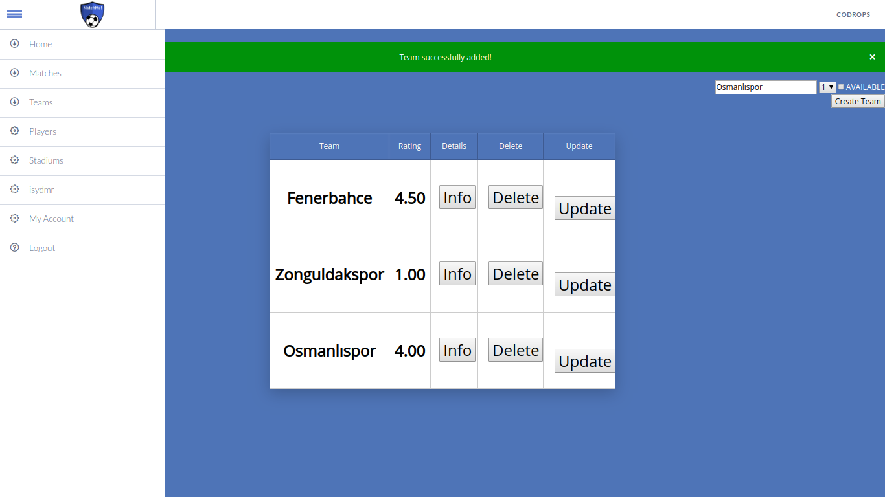

Using the right top field, a new team can be added.

Stadium Page
--------

This is stadiums page, all stadiums shown in one table.

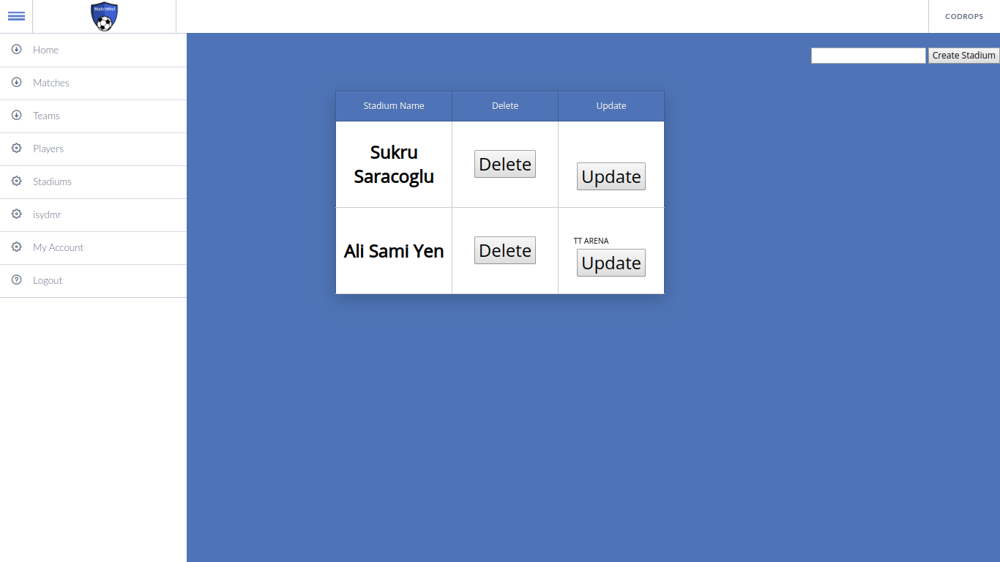

Stadium names can be updated using the update button.

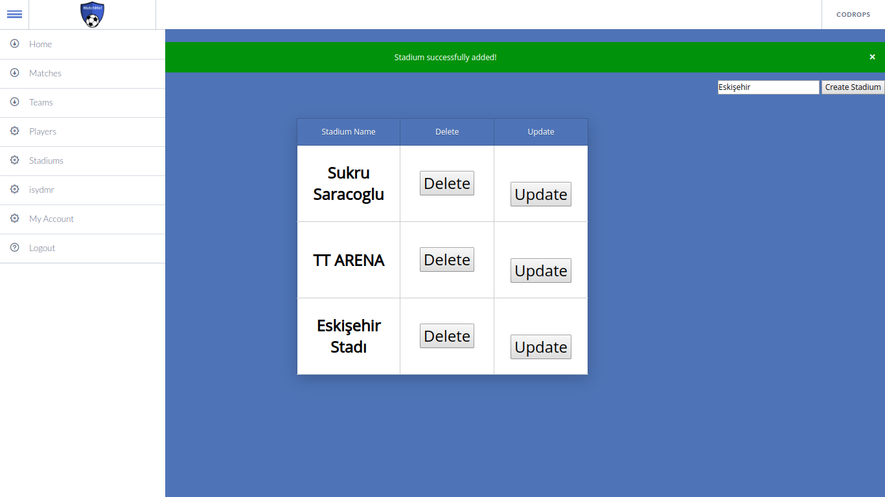

Using the right top field, a new stadium can be added.

Matches Page
--------

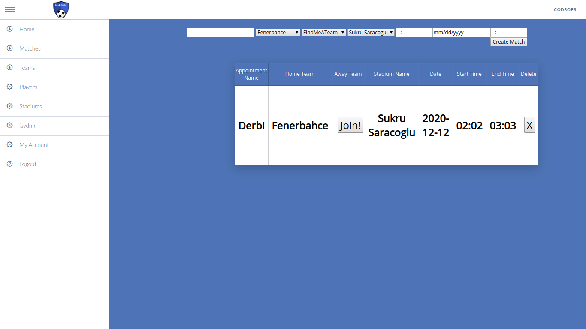

This is matches page, all appointments shown in one table.
A player can assign his/her team to an appointment, using the join button.

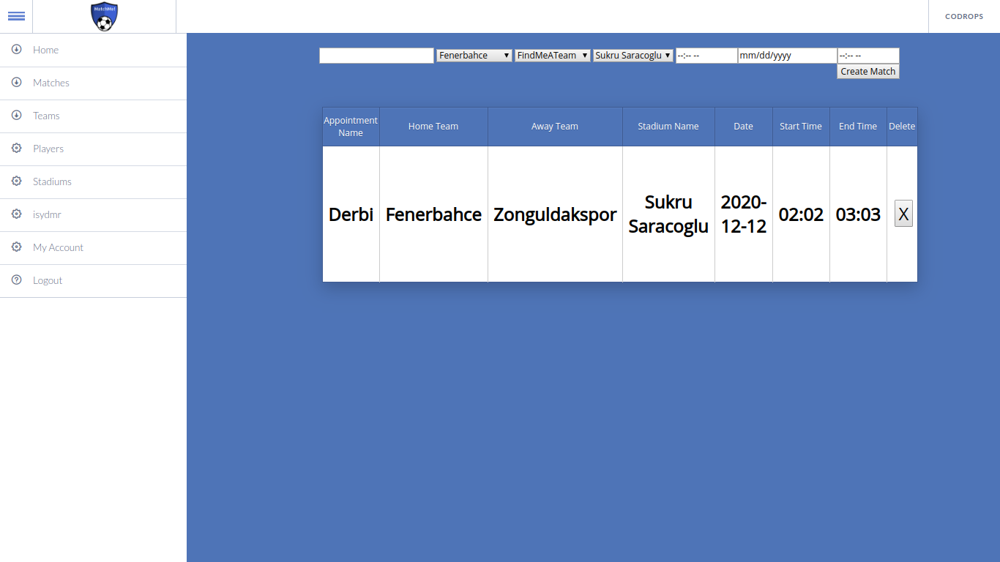

Here you can see the player assigned his team to the 'Derbi', using the join button.
An appointment can be deleted using the 'X' button in the table.

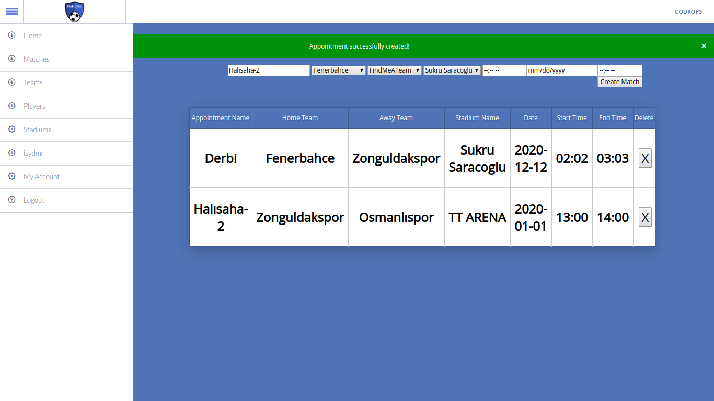

Using the input fields, on the top of the table, a player can create an appointment.